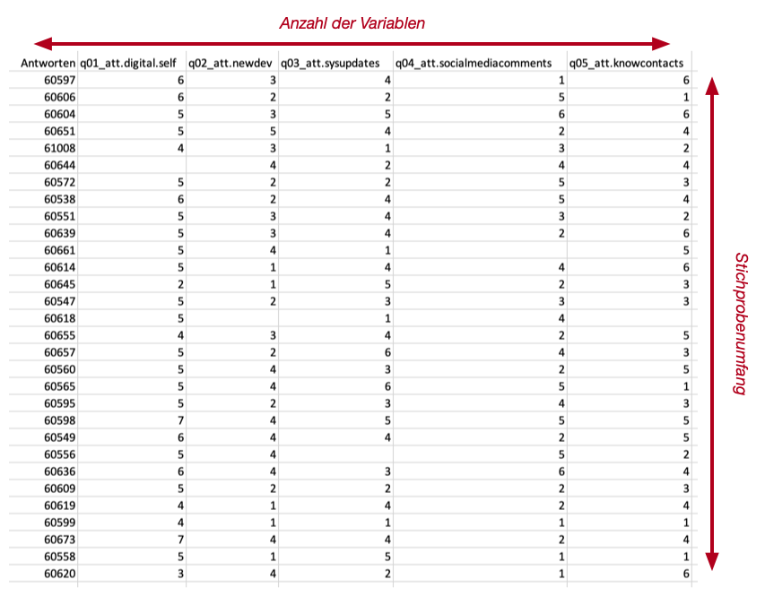

# Daten beschreiben {#sec-chapter-deskriptve-statistik}

> Die Anwendung statistischer Verfahren setzt voraus, dass quantitative Informationen über den jeweiligen Untersuchungsgegenstand bekannt sind. [@bortz_statistik_2010, S. 25]

::: {#def-deskriptive-statistik}
Die **deskriptive Statistik** bezeichnet die Vorgehensweisen und die erforderlichen Kennzahlen zum Beschreiben von Daten. 
:::

> Die Aufgabe der Deskriptivstatistik ist es, Daten prägnant zusammenzufassen. 
>
> @sauer_moderne_2019, S. 103

Die deskriptive Statistik ist ein wichtiger Schritt beim *Dekodieren* von Daten, weil sie Kennwerte liefert, oft als Grundlage für nachfolgende Arbeitsschritte dienen.

Die *deskriptive Statistik* beschreibt Messungen von sog. *Zufallsvariablen*, die in Stichproben zusammengefasst wurden. Die *Zufallsvariablen* sind die gemessenen *Merkmale* und eine *Stichprobe* entspricht 

::: {.callout-tip}
## Praxis
In der Praxis entsprechen **Zufallsvariablen** den *gemessenen Merkmalen* und eine **Stichprobe** entspricht einen Datenrahmen mit allen Vektoren der gemessenen Merkmale.
:::

Eine Stichprobe enthält also alle zusammengehörenden Datensätze einer Untersuchung.

## Umfänge 

::: {#def-umfang}
Ein **Umfang** bezeichnet die Anzahl von *gültigen Daten* vom gleichen Datentyp. 
:::

::: {#exm-vektor-umfang}
## Vektorumfang
Der Umfang ähnelt der Länge eines Vektors, mit dem Unterschied, dass bei der Länge einer Datenstruktur auch ungültige Werte mitgezählt werden können. Wurden alle ungültigen Werte aus einem Vektor entfernt, dann ist der Umfang des Vektors gleich dessen Länge. 
:::

::: {.callout-tip}
## Konvention
Umfänge werden in wissenschaftlichen Arbeiten in der Regel mit dem Buchstaben `n` gekennzeichnet.
:::

::: {.callout-note}
## Merke
Die Bestimmung von Umfängen ist immer ein **(Ab-) Zählproblem**. 
:::

### Universelle Kennzahlen

Zwei spezielle Umfänge ist der **Stichprobenumfang** und die **Anzahl der Variablen**. Weil sich diese beiden Werte für *alle Stichproben* bestimmen lassen, handelt es sich bei diesen beiden Umfängen um *universelle Kennzahlen* von Stichproben. 

::: {#def-universelle-kennzahlen} 
Mit **universellen Kennzahlen** sind abgeleitete Werte gemeint, die sich für *alle* Stichproben bestimmen lassen. 
:::

{#fig-stichprobenkennwerte}

::: {.callout-note}
## Merke
In **jeder** (wissenschaftlichen) Arbeit, in der Daten präsentiert werden, **müssen** die beiden universellen Kennwerte angegeben werden. Fehlen diese Kennwerte, dann ist die Arbeit *unvollständig*.
:::

Der **Stichprobenumfang** entspricht der Anzahl der Datensätze einer Stichprobe. Oft wird der Stichprobenumfang **zwei Mal** berichtet. Zuerst wird der unbereinigte Stichprobenumfang berichtet. Diese beinhalte alle Datensätze der Stichprobe, was der Anzahl der durchgeführten Messungen entspricht. Anschliessend werden alle ungültigen Datensätze entfernt und die verbleibenden Datensätze nocheinmal gezählt. Sind beide Werte gleich, dann darf der Stichprobenumfang nur einmal berichtet werden.

::: {.callout-important}
## Achtung

Jeder entfernte Datensatz entfernt gleichzeitig Information aus den Daten. Es sollten nur Datensätze entfernt werden, die sich eindeutig auf Messfehler zurückführen lassen.
:::

Typische Messfehler sind: 

- Leere Datensätze, 
- Doppelte Datensätze, die durch doppeltes Abspeichern entstehen,
- Abgebrochene Eingaben oder Übertragungen sowie
- Datensätze mit Werten, die eindeutig ausserhalb der gültigen Wertebereiche liegen.

::: {.callout-tip}
## Praxis
Die Bedingungen mit denen Datensätze zur Analyse aus einer Stichprobe entfernt werden, **müssen** dokumentiert und berichtet werden.

Die unkorrigierten Daten sollten auf keinen Fall gelöscht oder überschrieben werden, um sicherzustellen, dass fehlerhafte Korrekturen zu keinem Datenverlust führen!
::: 

Für die **Anzahl der Variablen** könnte prinzipiell auf die Dokumentation einer Stichprobe zurückgegriffen werden. Trotzdem sollten *beide* Kennzahlen bestimmt werden, um sicherzustellen, dass wirklich alle Variablen in einer Stichprobe berichtet und nicht versehentlich Variablen ausgelassen werden, die in der Dokumentation festgehalten werden.

::: {.callout-warning}
Weil automatisch generierte sequentielle Vektoren keine Zufallsvariablen sind, werden sie nicht zur Anzahl der Variablen hinzugezählt. Solche Vektoren sollten im Datenschema entsprechend markiert werden. 
:::

::: {.callout-tip}
## Konvention
In **Fragebogenstudien** wird die Anzahl der Vektoren als Anzahl der **Items** bezeichnet. Damit sind die unabhängig festgehaltenen Antwortmöglichkeiten gemeint. 
:::

::: {.callout-tip}
## Konvention
In **technischen Studien** wird die Anzahl der Vektoren als Anzahl der *Parameter*, *Vektoren* **oder** *Variablen* bezeichnet. Damit sind die voneinander unabhängig gemessenen Merkmale gemeint.
:::

Beim **Stichprobenumfang** bestimmen wir die Anzahl der Datensätze. Für die **Anzahl der Variablen** müssen wir die Vektoren zählen. 

::: {.callout-note}
## Merke
Stichproben sind immer **rechteckig**. Alle Variablen sind immer in allen Datensätzen vorhanden (horizontaler Umfang bzw. Anzahl der Variablen) und alle Datensätze haben für jede Variable einen Wert (vertikaler Umfang bzw. Stichprobenumfang).  Die Kennwerte lassen sich deshalb durch horizontales und vertikales zählen ermitteln.
:::

### Variablenumfang

Wenn Statistiker von Stichprobenumfang sprechen, dann verweist das Wort *Stichprobe* sehr häufig auf die gerade behandelten Vektoren und *nicht unbedingt* auf alle gemeinsam gemessenen Merkmale. Deshalb muss für jede Variable auch der **Variablenumfang** bestimmt werden.

::: {#def-variablenumfang}
Der **Variablenumfang** bezeichnet die Anzahl der gültigen Werte eines Vektors bzw. Merkmals.
:::

Zur Bestimmung des Variablenumfangs müssen alle fehlenden Werte aus dem entsprechenden Vektor entfernt werden, bevor der Umfang ermittelt wird. Deshalb ist es nicht unüblich, dass die einzelnen Merkmale voneinander und vom Stichprobenumfang abweichende Umfänge haben.
 
Weil in den Entsprechend müssen fehlende Werte vor der Bestimmung des Variablenumfangs aus dem Vektor entfernt werden. Es ist normal, dass sich der Stichprobenumfang und die Variablenumfänge unterscheiden. Diese Unterschiede entstehen dadurch, dass nicht alle Messungen erfolgreich verlaufen. Zum Beispiel passiert es häufig, dass Teilnehmende bei einem Fragebogen nicht alle Fragen beantworten oder beantworten können. In solchen Fällen ist der Stichprobenumfang grösser als die jeweiligen Variablenumfänge. So kommt es regelmässig vor, dass verschiedene Variablenumfänge sich ebenfalls unterscheiden. 

Die deskriptive Statistik muss daher **immer** den Stichprobenumfang **und** die Variablenumfänge anführen.

## Kennwerte der Skalenniveaus

Für Variablen wurden im @sec-datentypen die folgenden Skalenniveaus eingeführt, um Daten nach den Beziehungen zwischen den Werten des Wertebereichs zu kategorisieren. Dabei wurden die folgenden Kategorien eingeführt: 

1. Nominalskalierte Daten
2. Ordinalskalierte Daten
3. Metrisch-skalierte Daten (Intervall- oder Varianzskaliert)

Ein wichtiges Merkmal der Skalenniveaus sind die zulässigen Operationen über die Daten, woraus sich die zulässigen Kennwerte ableiten. Diese Kennwerte heissen **Lagemasse**, weil sie ein Mass für die Struktur der Werteverteilung darstellen. Weil die Skalenniveaus hierarchisch organisiert sind, beschreiben die Kennzahlen für Verteilungen des allgemeinere Skalennivaus automatisch auch Verteilungen der spezielleren Skalennivaus. Für metrisch-skalierte Daten gelten also automatisch auch die Kennzahlen für ordinalskalierte und nominalskalierte Daten. Für ordinalskalierte Daten gelten automatisch auch die Kennzahlen für nominalskalierte Daten, aber *nicht* die für metrisch-skalierte Daten.

**Nominalskalierte Daten** lassen sich nur über die Ungleichheit unterscheiden. Gleiche Werte dieser Datenkategorie dürfen nur gezählt werden. Daraus ergeben sich **absolute Häufigkeiten**. Werden absolute Häufigkeiten auf das Intervall 0-100 normalisiert, dann spricht man von **relativen Häufigkeiten**.  Weil es keine Beziehungen zwischen verschiedenen nominalskalierten Werten gibt, können nur die beiden Kennwerte der absuluten und relativen Häufigkeiten berichtet werden. Formal liesse sich auch noch der Modus bestimmen. Der Modus ist der am häufigsten vorkommende Wert, der sich direkt aus den absoluten bzw. relativen Häufigkeiten ergibt. In der Praxis wird der Modus nicht separat berichtet, sondern nur zusammen mit allen anderen relativen und absoluten Häufigkeiten.

**Ordinalskalierte Daten** lassen sich sortieren, so dass für jeden Wert eines Wertebereichs Grösser-Kleiner-Beziehungen zu allen anderen Werten festgelegt werden können. Entsprechend lassen sich die Werte auf eine Weise nummerieren, so dass die Nummerierung der Reihenfolge der Werte im Wertebereich widerspiegelt. Über diese Nummerierung lassen sich beliebige ordinalskalierte Werte auswerten und zusätzliche Kennwerte bestimmen:

- **Quantile** (bzw. Quartile) aus denen sich der **Median** und der **Interquartilsabstand** (engl. *Interquartile Range*) ableiten. 
- Die **mittlere absolute Abweichung vom Median** (eng. *Median Absolute Deviation* oder kurz **MAD**).

**Metrisch-skalierte Daten** haben gleiche Abstände und in der Regel auch gleiche Verhältnisse. Solche Daten sind nicht nur sortierbar, es ist zusätzlich auch die Division definiert und sie lassen sich oft durch stetige Funktionen beschreiben. Diese Funktion heisst für eine Verteilung die **Dichtefunktion** der Verteilung. Sie zeigt an, mit welcher Häufigkeit Werte wahrscheinlich auftreten können. Für jede dieser Verteilungen lässt sich der **Mittelwert** und die **Standardabweichung** bestimmen.

::: {.callout-note}
## Merke
@tbl-beschreibende-kennwerte-pro-skalierung zeigt die notwendigen Kennwerte für das entsprechende Skalenniveau. Die beschreibenden Kennwerte müssen für jedes gemessene Merkmal berichtet werden.
:::

| Skalierung | Zentrale Lagemasse | Streumasse |
| :--- | :--- | :-------  |
| Nominal | -  | absolute & relative Häufigkeit, Kontingenztabellen |
| Ordinal | Median |  Bandbreite, Quartil 1, Quartil 3, IQR, MAD |
| Metrisch | Median, Mittelwert | Standardabweichung, Bandbreite, Quartil 1, Quartil 3, IQR, MAD, Standardfehler |

: Minimale beschreibende Kennwerte nach Skalennivaus {#tbl-beschreibende-kennwerte-pro-skalierung}

::: {.callout-tip}
## Praxis

Die Kennwerte müssen **für alle** gemessenen Variablen zusammen mit dem Variablenumgang *n* berichtet werden.
:::

### Mittelwert

Der Mittelwert bzw. arithmetische Mittel kennzeichnet der durchschnittlichen Wert einer Verteilung. Der Mittelwert wird aus der Summe aller Werte geteilt durch die Anzahl der Werte bestimmmt (@eq-mittelwert).

$$
\bar{x} = \frac{\sum{v_i}}{n}
$$ {#eq-mittelwert}

Weil der Mittelwert eine *Mitte* einer Verteilung markiert, ist der Mittelwert ein sog. **zentrales Lagemass**.

Beim Mittelwert werden zwei Varianten unterschieden:

- Der *echte* Mittelwert ($\mu$) einer Verteilung $X$. 
- Der *gemessene* Mittelwert ($\bar{x}$, sprich "x-Balken" oder "x-bar") einer Verteilung $X$.

::: {.callout-tip}
## Praxis
Weil der echte Mittelwert einer Verteilung nur in Ausnahmefällen bekannt ist, wird nur der *gemessene Mittelwert berichtet.
:::

Damit ein zentrales Lagemass einer Verteilung beschreiben kann, muss diese Kennzahl ein gültiger Wert im Wertebereich der Daten sein. Wegen der Division zur Berechnung des **Mittelwerts**, kann diese Bedingung **nur für metrische Skalenniveaus** eingehalten werden.

### Median

Der Median (`md`) ist der *Wert*, an dem eine Verteilung in zwei Hälften geteilt wird. Dadurch markiert der Median eine *andere* Mitte einer Verteilung. Entsprechend ist auch der Median ein zentrales Lagemass. 

Für eine *sortierte* Werteverteilung lässt sich der Median aus der Anzahl der Werte bestimmen: Der Median ist der Wert an der Position $\frac{n}{2}$ eines **sortierten Vektors**. Diese Position ist jedoch nur für gerade Anzahlen gültig. Für eine ungerade Anzahl von Werten liegt der Median an der Position $\frac{n-1}{2}$.

Weil der Median aus der Position der Werte eines sortierten Vektors bestimmt wird, müssen die Daten *sortierbar* sein. Der Median ist für **metrisch-skalierte und** für **ordinalskalierte Werte** zulässig. 

### Absolute und relative Häufigkeiten

Bei der Feststellung der Häufigkeiten wird gezählt, wie oft ein Wert in einem Vektor auftritt. Dieser Wert heisst die **absolute Häufigkeit** des Werts. 

Die absoluten Häufigkeiten lassen sich *normieren*. Es ist üblich die Häufigkeiten als Anteile des Ganzen anzugeben. Oft werden diese Anteile als Prozentwerten angegeben. Diese Anteile heissen **relative Häufigkeiten**, weil die Werte den Anteil relativ zur Gesamtzahl aller Werte abgibt. 

Die relativen Häufigkeit eines Werts ergibt aus der absoluten Häufigkeit sich, indem die absolute Häufigkeit durch den Umfang des Vektors geteilt wird.

::: {.callout-tip}
## Praxis

Es **müssen** immer die absoluten **und** die relativen Häufigkeiten berichtet werden.
:::

Weil die Häufigkeiten beschreiben, über welche Werte die gemessenen Daten *gestreut* sind, werden diese Masse auch den **Streumassen** zugerechnet. 

::: {.callout-note}
## Merke
Alle Häufigkeiten beschreiben zusammen die *Verteilung* der gemessenen Werte. 
:::

::: {.callout-note}
## Merke

Bei absoluten und relativen Häufigkeiten sind die **Wertintervalle unveränderlich**. 
:::

::: {.callout-tip}
## Praxis
Weil für **nominalskalierte Daten** keine anderen Lagemasse zur Verfügung stehen, **müssen** die Häufigkeiten für dieses Skalenniveau immer angegeben werden!
:::

Es ist üblich neben der absoluten und relativen Verteilung *eines* Merkmals, auch die **gemeinsamen Häufigkeiten** von zwei nominalskalierten Merkmalen in Form von *Kontingenztabellen* (@sec-chapter-matrix-operationen) anzugeben und damit die erhobenen Daten besser zu beschreiben.

Für **metrisch-skalierte Werte** lassen sich die Häufigkeiten nicht so leicht bestimmen, wie für die anderen Skalennivaus. Zur Bestimmung der Häufigkeiten von metrisch-skalierten Daten, wird der Wertebereich in gleichgrosse Intervalle gegliedert. Anschliessend wird die Anzahl der Werte in jedem Intervall gezählt. Diese Intervalle erzeugen künstlich diskrete Wertebereiche. 

::: {.callout-tip}
## Praxis
Die Häufigkeiten von metrisch-skalierten Daten werden normalerweise nur als Histogram dargestellt und nicht separat angegeben. 
:::

### Bandbreite

Die **Bandbreite** der gemessenen Werte ergibt sich aus dem Abstand zwischen dem kleinsten und dem grössten gemessenen Wert. Entsprechend werden der kleinste und der grösste Wert als Kennwert für die Bandbreite angegeben. Gelegentlich ist es notwendig die Bandbreite als eigenen Wert aufzuführen. Das ist z.B. dann sinnvoll, um ähnliche Bandbreiten in unterschiedlichen Wertebereichen hervorzuheben. In solchen Fällen wird die Bandbreite als Differenz zwischen dem grössten und kleinsten Wert berechnet (@eq-bandbreite).

$$
bd = | x_{max} - x_{min} |
$$ {#eq-bandbreite}

::: {.callout-note}
## Merke
Die Bandbreite ist vorzeichenlos.
:::

### Quantile und Quartile

Quantile gliedern eine Verteilung in gleichgrosse Häufigkeiten und kennzeichnen die Wertintervalle, über welche sich diese Häufigkeiten erstrecken. 

::: {#def-quantil}
Ein **Quantil** ist der Wert, der zwei Bereiche mit gleichvielen Werten *trennt*. Das Quantil wird dem kleineren der beiden Wertebereiche zugerechnet.
:::

::: {.callout-note}
## Merke

Bei Quantilen ist die **Anzahl der Werte in einem Intervall unveränderlich**.
:::

::: {.callout-important}
## Achtung

Ein besonderes Quantil ist der **Median**. Weil der Median auch als zentrales Lagemass verwendet wird, wird der Median **nie** als Quantil angegeben, sondern immer als der **Median** gesondert hervorgehoben. 
:::

Zur Bestimmung der Quantile müssen die gemessenen Werte sortiert werden. Entsprechend lassen sich Quantile nur für ordinal- und metrisch-skalierte Daten bestimmen. 

Weil die Anzahl der Werte in einem Intervall fest ist, lassen sich über die Abstände zwischen den Quantilen Rückschlüsse über die Verteilung der gemessenen Werte ziehen: Sind die Abstände zwischen den Quantilen klein (oder auch `0`), dann liegen viele Werte in diesem kleinen Bereich. Weil die Quantile die Verteilung beschreiben sind auch sie **Streumasse einer Verteilung**.

Eine häufig verwendete Variante der Quantile sind die **Quartile**. Diese Teilen die Verteilung in vier Bereiche, die gleich viele Werte enthalten. Als Quartil wird den Wert bezeichnet, der zwei dieser Bereiche trennt. Das 50%-Quartil ist identisch mit dem Median und wird deshalb **nicht** als Quartil bezeichnet. Es gibt also **zwei** Quartile. 

- Das 25%-Quartil markiert das Ende der kleinsten Viertels der Werte. 
- Das 75%-Quartil markiert das Ende der kleinsten drei-Viertel der Werte.

Die Differenz zwischen dem 75%- und dem 25%-Quartil heisst Interquartilabstand oder angekürzt **IQR** (für engl. *interquartile Range*). 

### Standardabweichung und Varianz

Ein besonderes Streumass für metrisch-skalierte Daten ist die **Varianz**. Die Varianz kennzeichnet die Variabilität der Werte relativ zum Mittelwert. Die Varianz ist immer ein positiver Wert. 

Die Varianz ist als der mittlere quadratische Abstand zum Mittelwert definiert (@eq-varianz).

$$
var = \frac{1}{n} \sum{(x_i-\bar{x})^2}
$$ {#eq-varianz}

Wie auch beim Mittelwert werden zwei Arten der Varianz unterschieden: 

1. Die *echte Varianz*, die mit dem grichischen Buchstaben Sigma ($\sigma^2$) gekennzeichnet wird
2. Die *gemessene Varianz* ($s^2$)

Weil die Varianz vorzeichenlos ist und durch das Quadrieren nicht die gleiche Masseinheit hat wie die Werte, lassen sich die Varianz und die Werte nicht direkt miteinander vergleichen.

Besser wäre ein Kennwert für die Streuung um den Mittelwert, der direkt mit den Werten vergleichbar ist. Ein solcher Kennwert ist die **Standardabweichung**. Die **Standardabweichung** hängt direkt mit der Varianz zusuammen: Sie ist die Wurzel der Varianz und hat die gleiche Masseinheit wie die Werte. 

### Standardfehler

Ein besonderer Kennwert ist der sog. Standardfehler.

::: {#def-standardfehler}
Der **Standardfehler des Mittelwerts** beschreibt den Bereich in welchem der (unbekannte) *echte Mittelwert µ* relativ zum *gemessenen Mittelwert $\bar{x}$* liegt.
:::

::: {.callout-note}
## Merke
Der Standardfehler ist ein Kennwert für die Genauigkeit gemessenen Mittelwerts.
:::

Der Standardfehler wird in der Praxis meist mit dem Symbol ***se*** abgekürzt. In der insbes. deutschsprachigen Literatur finden sich zusätzlich uneinheitliche Schreibweisen wie z.B. $\sigma_{\bar{x}}$ oder $\sigma_{\hat{\vartheta}}$. Weil sich das Symbol $\sigma$ jedoch auf die *echte Standardabweichung* bezieht und der Standardfehler immer aus der *gemessene Standardabweichung (s)* hergeleitet wird, ist die im anglo-amerikanischen Raum verbreitete Schreibweise ***se*** für *standard error* vorzuziehen.

Der Standardfehler wird über die @eq-standardfehler bestimmt. Aus dieser Formel geht hervor, dass sich der Standardfehler aus der Standardabweichung und dem Variablenumfang herleitet. Weil die Standardabweichung nur für metrisch-skalierte Daten definiert ist, ist der Standardfehler ebenfalls nur für diese Skalierung definiert. 

$$
se = \frac{s}{\sqrt{n}}
$$ {#eq-standardfehler}

Aus @eq-standardfehler lässt sich ableiten, dass der Standardfehler mit zunehmenden Variablenumfang immer kleiner wird. Diese Eigenschaft hängt damit zusammen, dass je mehr Werte gemessen wurden, der gemessene Mittelwert sich immer mehr dem echten Mittelwert annähert. 

### MAD

Der Interquartilsabstand (IQR) ist ein *Standardmass*, dass sich aus den Quartilsgrenzen ergibt. *Standardmass* bedeutet in diesem Fall, dass für Studien vorausgesetzt wird, dass dieser Wert für ordinal- und z.T. auch für metrisch-skalierte Daten berichtet wird. Der IQR hat jedoch zwei wichtige Nachteile: 

1. Der IQR gibt aber nur über einen Teil der Stichprobe Auskunft, nämlich genau über die Hälfte der Stichprobe. Das liegt daran, dass der IQR in den Grenzen der beiden Quartile definiert ist. Weil zwischen den beiden Quartilen einer Stichprobe nur die Hälfte der Werte liegt, bleibt die andere Hälfte der Werte unberücksichtigt. 
2. Der IQR muss anders interpretiert werden, als die Varianz bzw. die Standardabweichung. Während die Standardabweichung alle Werte in Beziehung zum zentralen Lagemass des Mittelwerts setzt, gibt der IQR an über wie viele Werte sich die Hälfte der Daten verteilt.

Für ordinalskalierte Daten ist also ein Streumass wünschenswert, das alle Werte berücksichtigt und sie relativ zum zentralen Lagemass des Medians beschreibt Dieses Mass ist die sog. **Mittlere absolute Abweichung vom Median** (MAD).  Wie der IQR oder die Standardabweichung ist dieses Mass ein Kennwert für die Streuung der Werte. 

Die MAD ist wie auch die Standardabweichung in Relation zum zentralen Lagemass des Median definiert: Die MAD ist der Median der absoluten Abstände zum Median der Daten (@eq-mad). Es werden die absoluten Abstände verwendet, um ein vorzeichenloses Ergebnis zu erhalten. Gleichzeitig stellt der Absolutbetrag der Differenz sicher, dass sich die Werte nicht gegenseitig aufheben. Ohne den Absolutbetrag ist das möglich, weil jeweils die Hälfte der Werte ober- und unterhalb des Medians liegen. Weil für ordinalskalierte Werte die Verhältnisse und Differenzen nicht sichergestellt sind, werden für die MAD keine Multiplikationen oder Divisionen verwendet.

$$
MAD(x) = md(| x_i - md(x) |)
$$ {#eq-mad}

Das Ergebnis zeigt die zentrale Tendenz für *alle Werte* unserer Stichprobe in Bezug auf den Median. Ist der Wert klein, dann weist das auf insgesamt dicht zusammenliegende Werte hin. Ist dieser Wert gross, dann weist das auf eine breit gestreute Werte hin. Der Vorteil der MAD ist, dass dieser Wert genau gleich wie die Standardabweichung interpretiert wird.

::: {#exm-mad}
## MAD im Verhältnis zum IQR

| variable | n | md | iqr| mad |
| ---: | ---: | ---: | ---: | ---: |
| q10_1_0 | 27 | 7 | 3.5 | 1.8888889 | 1.8888889 |
| q10_1_1 | 27 | 9 | 1.5| 0.8888889 | 0.8888889 | 
:::

::: {.callout-warning}
## Achtung
Obwohl die MAD als Streumass besser geeignet ist als der IQR, wird das Mass seltener in empirischen Arbeiten verwendet. Die MAD sollte deshalb **immer** zusammen mit dem IQR berichtet werden und in ihrer Bedeutung als Streumass im Text hervorgehoben werden. 
:::
